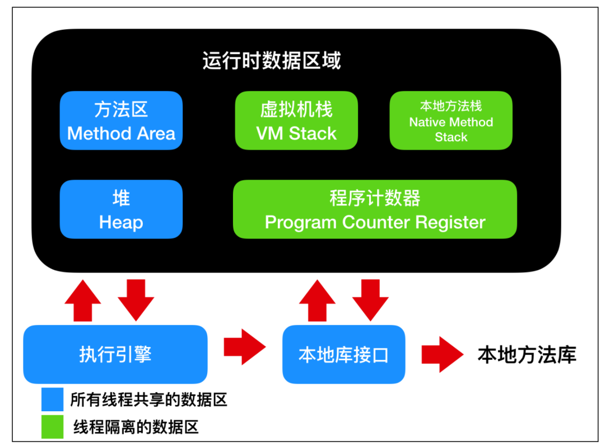

## JVM内存模型

- `虚拟机栈` : Java 虚拟机栈是线程私有的数据区，Java 虚拟机栈的生命周期与线程相同，虚拟机栈也是局部变量的存储位置。方法在执行过程中，会在虚拟机栈中创建一个 `栈帧(stack frame)`。
- `本地方法栈`: 本地方法栈也是线程私有的数据区，本地方法栈存储的区域主要是 Java 中使用 `native` 关键字修饰的方法所存储的区域
- `程序计数器`：程序计数器也是线程私有的数据区，这部分区域用于存储线程的指令地址，用于判断线程的分支、循环、跳转、异常、线程切换和恢复等功能，这些都通过程序计数器来完成。
- `方法区`：方法区是各个线程共享的内存区域，它用于存储虚拟机加载的 类信息、常量、静态变量、即时编译器编译后的代码等数据，也就是说，**static 修饰的变量存储在方法区中**
- `堆`：堆是线程共享的数据区，堆是 JVM 中最大的一块存储区域，所有的对象实例，包括**实例变量都在堆上**进行相应的分配。

## JVM内存调优监控工具

[https://blog.csdn.net/luzhensmart/article/details/105848424](https://blog.csdn.net/luzhensmart/article/details/105848424)

- jps：列出程序中有哪些Java进程；
- jinfo：列出和JVM相关的属性；
- jstack：列出当前Java进程中有哪些线程。
- jmap -histo pid | head -20：
- jconsole、jvisualvm：JVM内存查看
- jad：反编译出正在运行的程序的源码

## G1并发标记算法的核心：三色标记

- 白色：未被标记的对象
- 灰色：自身被标记，成员变量未被标记
- 黑色：自身和成员变量均已标记完成

## 并发标记算法常见问题

